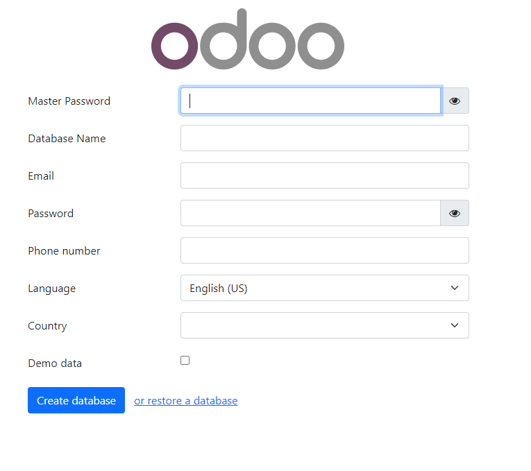
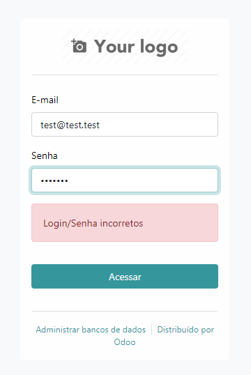
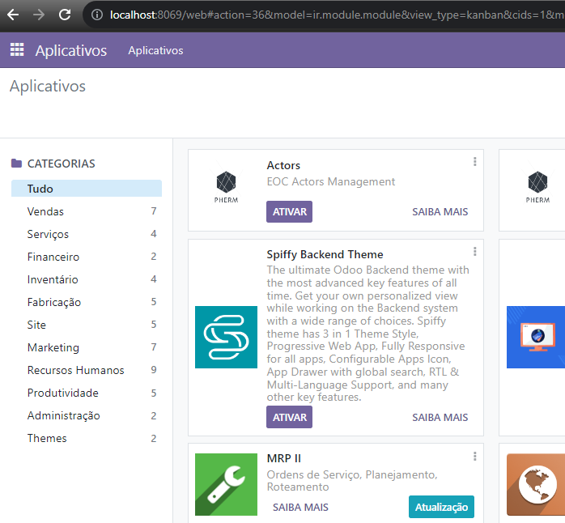
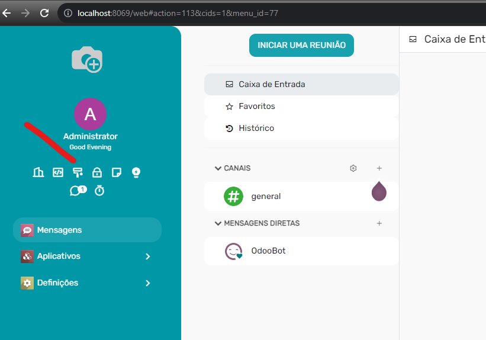
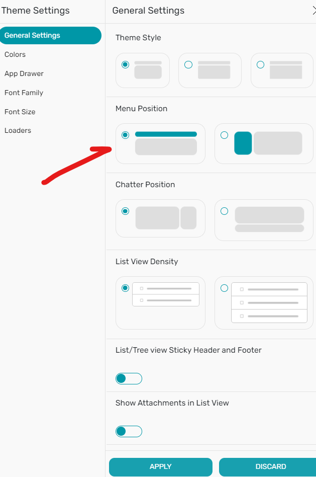
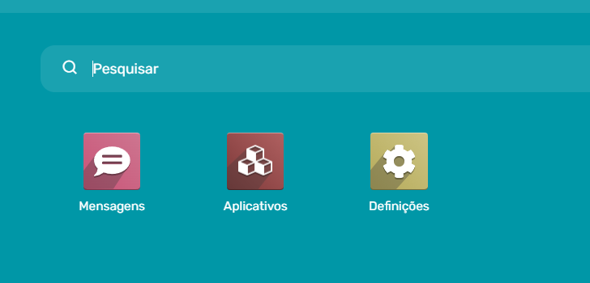
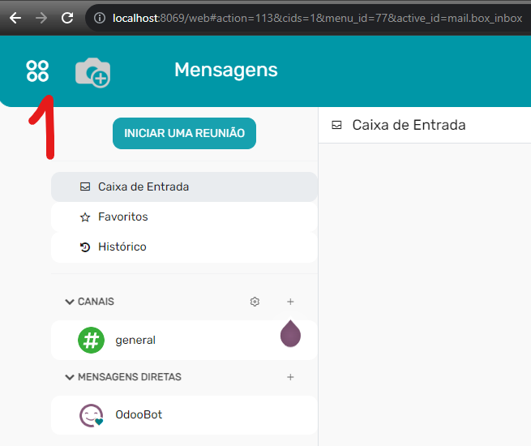

# Steps to Build Ephem with Docker

## Configuration

1. Start by creating a file named `.env` based on the `.env.example` template and fill in the required variables. Refer to the comments within the file for guidance.
2. In the `ssh_keys` folder, place your `id_ed25519` and `id_ed25519.pub` ssh key pair files. This key pair is essential for accessing the git repository of ephem, so ensure it has the necessary permissions by requesting access from the project manager.
3. If you're using a proxy, such as Nginx, you must update the `odoo.conf` file with the proxy configuration. Refer to the comments within the file for instructions.

## Using docker-compose to Build and Run

```bash
docker-compose up -d
```

Or to build/rebuild and run in one command:

```bash
docker-compose up -d --build
```

After running the command above, open your web browser and navigate to `http://localhost:8069`.



In the image above, you can see the first page of the installation wizard. Fill in the required fields and click the "Create database" button. Subsequently, you will be redirected to the login page.

**Note**:

- The "Master Password" field corresponds to the admin user's password for the database and is sourced from the `odoo16.conf` file.
- The "Database Name" field specifies the name of the database to be created, e.g., "test"
- The "Email" field is the admin user's email address, which will be used for system login.
- The "Password" field is the admin user's login password.
- The "Phone Number," "Country," and "Demo Data" fields are optional.

Afterwards, you will be redirected to the login page, where you can log in using the email and password provided during the installation wizard.



In the image above, you can see the login page. Fill in the fields and click the "Log in" button.

Next, you will be directed to the apps page. Here, you need to install certain apps.



In the image above, you can see the apps page. Activate the "Spiffy Backend Theme" app.



In the image above, you can see the options for the "Spiffy Backend Theme" app. Click on the "Theme Settings" icon.



Adjust the theme settings to your preferences, such as the Menu Position, and then click the "Apply" button.

Next, click on the main menu icon:





As shown, the ephem app has not yet been installed. Click on the "Apps" button to return to the apps page. Then install:

- EOC Signal Management

Please note that EOC apps are sourced from the git repository located in the `odca` folder, as configured in the Dockerfile.

# Activating Developer Mode

To activate developer mode, follow the instructions outlined in [https://www.odoo.com/documentation/16.0/pt_BR/applications/general/developer_mode.html](https://www.odoo.com/documentation/16.0/pt_BR/applications/general/developer_mode.html).

In summary, you need to:

1. Install the Odoo Debug addon for Google Chrome or Firefox.
2. Activate developer mode in your browser.
3. Once activated, you will have access to settings, including the option for Translation, among others.

This enables the possibility to translate the system.

# Notes about Translations

1. Kanban column titles are sourced from `./odca/eoc_signals/data/stagestatesignals.xml` and are therefore translatable.
2. The `signal_state_state_id` is also derived from `./odca/eoc_signals/data/stagestatesignals.xml` and is likewise translatable.

# Example of Database Backup

The `docker-compose.yml` file contains an image entry named `backup` that is used to create backups of the database. Configuration settings for this image can be found in the `backup` folder. The backup operation is executed using the `pg_dump` command, which is run by the `backup-script.sh` script. The scheduling of the backup is determined by the `crontab` file, and the backup files are stored in the `backup/backus` folder. The backup occurs daily at 3:00 AM, as configured in the `backup/crontab` file.

## Restore a Database Backup

Access http://localhost:8069/web/database/manager and click on the "Restore Database" button. And choose the backup file.

# Configuring proxy, ssl and domain

TODO
