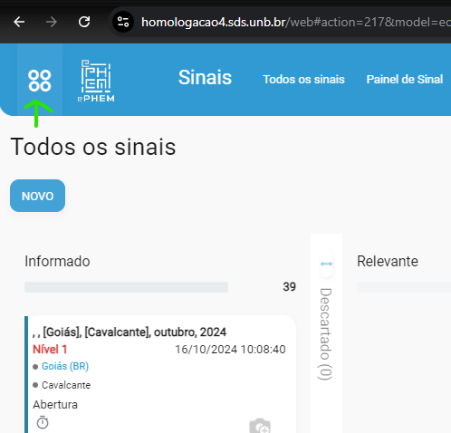
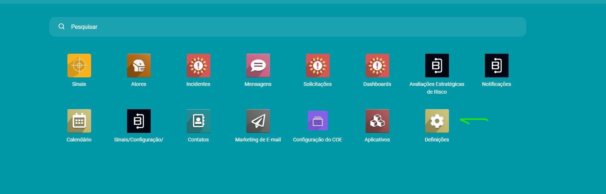
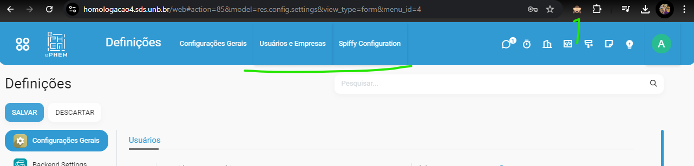
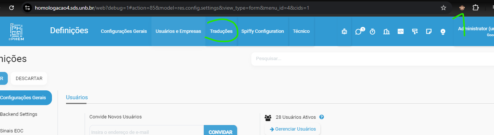
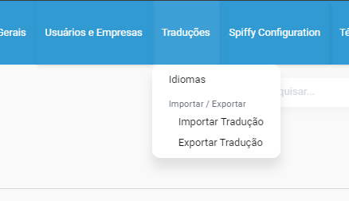
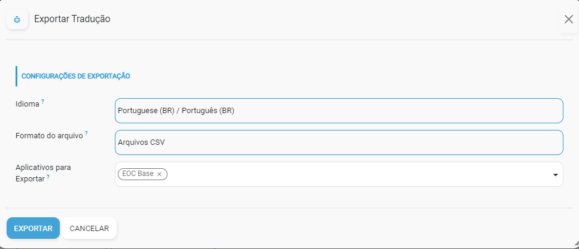
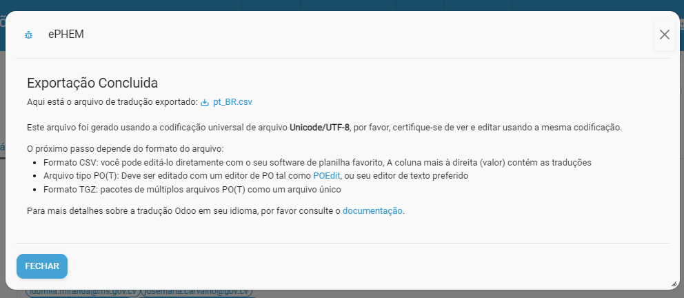
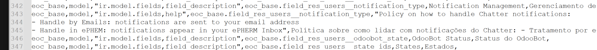
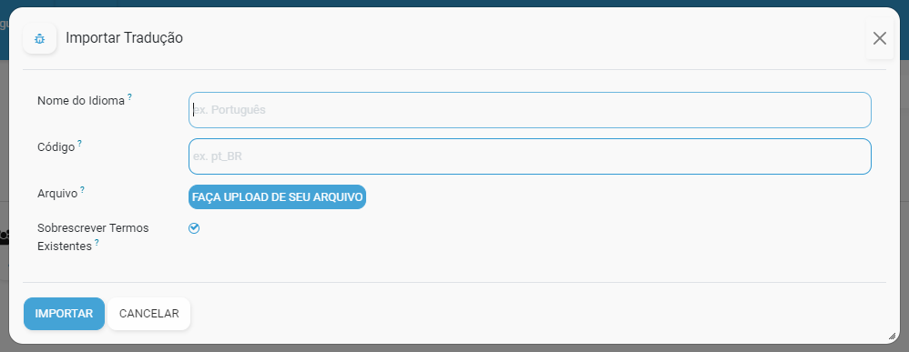

# Atualizando Traduções Ephem

Este tutorial explica como atualizar as traduções do sistema Ephem, que é baseado no Odoo. As traduções são mantidas pela equipe do projeto. Para atualizá-las, siga os passos descritos a seguir.

## Pré-requisitos

O Ephem é baseado no Odoo, portanto é necessário ter conhecimentos básicos sobre o funcionamento do Odoo. Além disso, você precisará da extensão [Odoo Debug](https://chromewebstore.google.com/detail/odoo-debug/hmdmhilocobgohohpdpolmibjklfgkbi?hl=PT_BR&pli=1) para o Chrome, que habilita a tradução de textos no sistema.

Este tutorial utiliza o ambiente de homologação como exemplo, mas as instruções também se aplicam ao ambiente de produção.

## Habilitando o Menu de Traduções

1. Acesse a plataforma Ephem em [https://homologacao4.sds.unb.br/web/login](https://homologacao4.sds.unb.br/web/login) usando as credenciais de administrador (solicite à equipe do projeto).

2. No menu principal, clique em **Definições** e depois em **Traduções**.

   

   

Por padrão, o menu de traduções não está visível até que a extensão Odoo Debug seja ativada. O ícone da extensão aparece no canto superior direito do navegador com a imagem de um macaquinho com os olhos cobertos.

   

3. Clique no ícone da extensão Odoo Debug para ativá-la. O ícone mudará para um macaquinho com os olhos abertos, e a página será recarregada automaticamente, tornando o menu de traduções visível.

   

## Atualizando as Traduções

1. No menu de traduções, você verá as opções **Importar Tradução** e **Exportar Tradução**.

   

2. O primeiro passo é exportar as traduções atuais. Clique em **Exportar Tradução** e preencha o formulário exibido, conforme a imagem abaixo:

   

### Campos do Formulário de Exportação

- **Idioma**: Selecione o idioma que deseja exportar. No caso do Ephem, o idioma é Português (BR).
- **Formato do Arquivo**: Selecione **Arquivos CSV**.
- **Aplicativos para Exportar**: Escolha os aplicativos que deseja exportar as traduções. No Ephem, as principais opções são "EOC Base", "EOC Incident Management" e "EOC Signal Management". Selecione um módulo por vez.

3. Após preencher os campos, clique em **Exportar**. O sistema processará a solicitação e fornecerá o link para download do arquivo de tradução.

   

4. Baixe o arquivo CSV gerado e salve-o em uma pasta de sua escolha com um nome fácil de identificar, por exemplo, `eoc_base_a_ser_traduzido.csv`.

## Preparando o Arquivo de Tradução

1. Abra o arquivo CSV em um editor de texto que suporte codificação UTF-8, como o Notepad++. O arquivo contém as seguintes colunas: `module`, `type`, `name`, `res_id`, `src`, `value`, `comments`. Veja um exemplo:

   ```csv
   module,type,name,res_id,src,value,comments
   eoc_base,model,"ir.actions.act_window,name",eoc_base.action_eoc_notification,Notifications,Notificações,
   ```

### Descrição das Colunas

- **module**: Módulo do sistema.
- **type**: Tipo de tradução (pode ser model, view, report, menu, action, etc.).
- **name**: Nome do campo a ser traduzido.
- **res_id**: ID do recurso a ser traduzido.
- **src**: Texto original em inglês.
- **value**: Texto traduzido.

2. Realize uma limpeza no arquivo CSV:

- **Quebras de Linha**: Remova quebras de linha em campos de tradução, mantendo o texto em uma única linha.
  
  

- **Campos HTML de Templates de E-mail**: Traduções de campos HTML de e-mails podem ser removidas, pois não afetam o funcionamento do sistema.

## Usando o Google Planilhas para Traduzir

1. Importe o arquivo CSV para o Google Planilhas. Faça o upload do arquivo no Google Drive e abra-o no Google Planilhas.

2. Crie novas colunas no Google Planilhas para facilitar a tradução: **tradução automática**, **tradução anterior**, **tradução importar**, **comentários**, e uma **coluna auxiliar** para concatenar os valores.

   - **tradução automática**: `=GOOGLETRANSLATE(E2; "en"; "pt")`
   - **tradução anterior**: `=VLOOKUP(E2;'EOC Base 2024-07 v4'!E:J;6;0)` (para buscar traduções anteriores).
   - **tradução importar**: `=IF(NOT(ISERROR(I2)); I2; H2)` (importa a tradução automática ou a tradução anterior).
   - **coluna auxiliar**: Concatena as colunas novamente: `=$Q$1&A2&$Q$1&","&$Q$1&B2&$Q$1&","&$Q$1&C2&$Q$1&","&$Q$1&D2&$Q$1&","&$Q$1&E2&$Q$1&","&$Q$1&J2&$Q$1&",,"`.

3. Após finalizar as traduções, copie a **coluna auxiliar** e cole o conteúdo em um novo arquivo CSV. Salve-o com um nome como `eoc_base_traduzido.csv`.

## Importando as Traduções

1. No menu de traduções, clique em **Importar Tradução**. Um formulário será exibido:

   

### Campos do Formulário de Importação

- **Nome do Idioma**: Digite "Português".
- **Código**: Digite "pt_BR".
- **Arquivo**: Selecione o arquivo CSV que você traduziu, por exemplo, `eoc_base_traduzido.csv`.

2. Clique em **Importar** e aguarde o processamento. Se houver erros, revise o arquivo CSV.

3. Após a importação, atualize a página para aplicar as traduções.

## Verificando as Traduções

1. Após a importação, acesse o sistema e verifique se as traduções foram aplicadas corretamente. Caso encontre problemas, repita o processo de exportação, tradução e importação.
